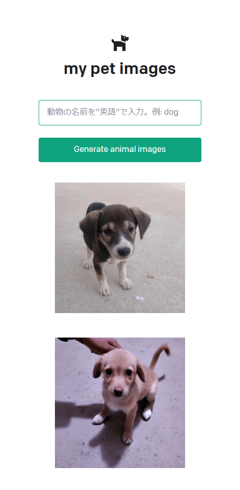

# OpenAI API Quickstart - Node.js example app

This is an example pet name generator app used in the OpenAI API [quickstart tutorial](https://beta.openai.com/docs/quickstart). It uses the [Next.js](https://nextjs.org/) framework with [React](https://reactjs.org/). Check out the tutorial or follow the instructions below to get set up.

■ revison 20230121

Changed from the function to automatically generate pet names with AI to automatically generate pet images with AI.

ペットの名前をAIで自動生成する機能から変更してペットの画像をAIで自動生成するようにしました。



## Setup

1. If you don’t have Node.js installed, [install it from here](https://nodejs.org/en/) (Node.js version >= 14.6.0 required)

2. Clone this repository

3. Navigate into the project directory

   ```bash
   $ cd openai-quickstart-node
   ```

4. Install the requirements

   ```bash
   $ npm install
   ```

5. Make a copy of the example environment variables file

   On Linux systems: 
   ```bash
   $ cp .env.example .env
   ```
   On Windows:
   ```powershell
   $ copy .env.example .env
   ```
6. Add your [API key](https://beta.openai.com/account/api-keys) to the newly created `.env` file

7. Run the app

   ```bash
   $ npm run dev
   ```

You should now be able to access the app at [http://localhost:3000](http://localhost:3000)! For the full context behind this example app, check out the [tutorial](https://beta.openai.com/docs/quickstart).
